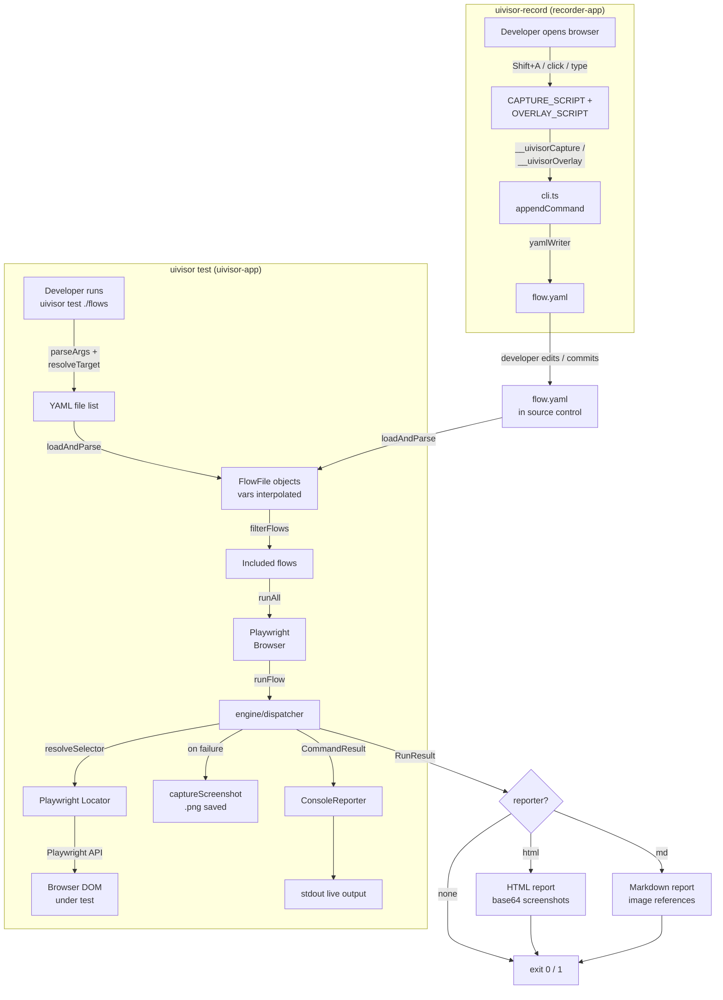

# End-to-End Data Flow

This diagram shows the full lifecycle from recording a flow with `uivisor-record` through replaying and reporting it with `uivisor test`.

```mermaid
flowchart TD
    subgraph recorder-app ["uivisor-record (recorder-app)"]
        RA[Developer opens browser] -->|Shift+A / click / type| RB[CAPTURE_SCRIPT +\nOVERLAY_SCRIPT]
        RB -->|__uivisorCapture /\n__uivisorOverlay| RC[cli.ts\nappendCommand]
        RC -->|yamlWriter| RD[flow.yaml]
    end

    RD -->|developer edits / commits| RD2[flow.yaml\nin source control]

    subgraph uivisor-app ["uivisor test (uivisor-app)"]
        UA[Developer runs\nuivisor test ./flows] -->|parseArgs +\nresolveTarget| UB[YAML file list]
        UB -->|loadAndParse| UC[FlowFile objects\nvars interpolated]
        UC -->|filterFlows| UD[Included flows]

        UD -->|runAll| UE[Playwright\nBrowser]
        UE -->|runFlow| UF[engine/dispatcher]
        UF -->|resolveSelector| UG[Playwright Locator]
        UG -->|Playwright API| UH[Browser DOM\nunder test]

        UF -->|on failure| UI[captureScreenshot\n.png saved]
        UF -->|CommandResult| UJ[ConsoleReporter]
        UJ --> UK[stdout live output]
    end

    RD2 -->|loadAndParse| UC
    UF -->|RunResult| UL{reporter?}
    UL -->|html| UM[HTML report\nbase64 screenshots]
    UL -->|md| UN[Markdown report\nimage references]
    UL -->|none| UO[exit 0 / 1]
    UM --> UO
    UN --> UO
```
