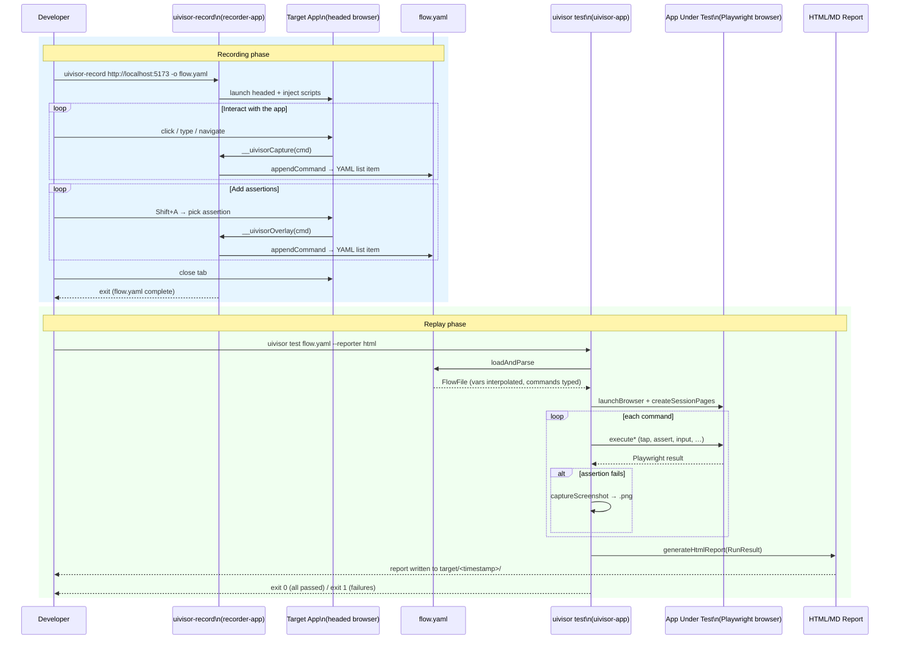

# End-to-End Sequence Diagram

Shows the full developer workflow: recording a flow with `uivisor-record`, then replaying it with `uivisor test`.

```mermaid
sequenceDiagram
    participant Dev as Developer
    participant Recorder as uivisor-record\n(recorder-app)
    participant AppBrowser as Target App\n(headed browser)
    participant FlowFile as flow.yaml
    participant Runner as uivisor test\n(uivisor-app)
    participant TestBrowser as App Under Test\n(Playwright browser)
    participant Report as HTML/MD Report

    rect rgb(230, 245, 255)
        Note over Dev,FlowFile: Recording phase
        Dev->>Recorder: uivisor-record http://localhost:5173 -o flow.yaml
        Recorder->>AppBrowser: launch headed + inject scripts
        loop Interact with the app
            Dev->>AppBrowser: click / type / navigate
            AppBrowser->>Recorder: __uivisorCapture(cmd)
            Recorder->>FlowFile: appendCommand → YAML list item
        end
        loop Add assertions
            Dev->>AppBrowser: Shift+A → pick assertion
            AppBrowser->>Recorder: __uivisorOverlay(cmd)
            Recorder->>FlowFile: appendCommand → YAML list item
        end
        Dev->>AppBrowser: close tab
        Recorder-->>Dev: exit (flow.yaml complete)
    end

    rect rgb(240, 255, 240)
        Note over Dev,Report: Replay phase
        Dev->>Runner: uivisor test flow.yaml --reporter html
        Runner->>FlowFile: loadAndParse
        FlowFile-->>Runner: FlowFile (vars interpolated, commands typed)
        Runner->>TestBrowser: launchBrowser + createSessionPages
        loop each command
            Runner->>TestBrowser: execute* (tap, assert, input, …)
            TestBrowser-->>Runner: Playwright result
            alt assertion fails
                Runner->>Runner: captureScreenshot → .png
            end
        end
        Runner->>Report: generateHtmlReport(RunResult)
        Report-->>Dev: report written to target/<timestamp>/
        Runner-->>Dev: exit 0 (all passed) / exit 1 (failures)
    end
```
