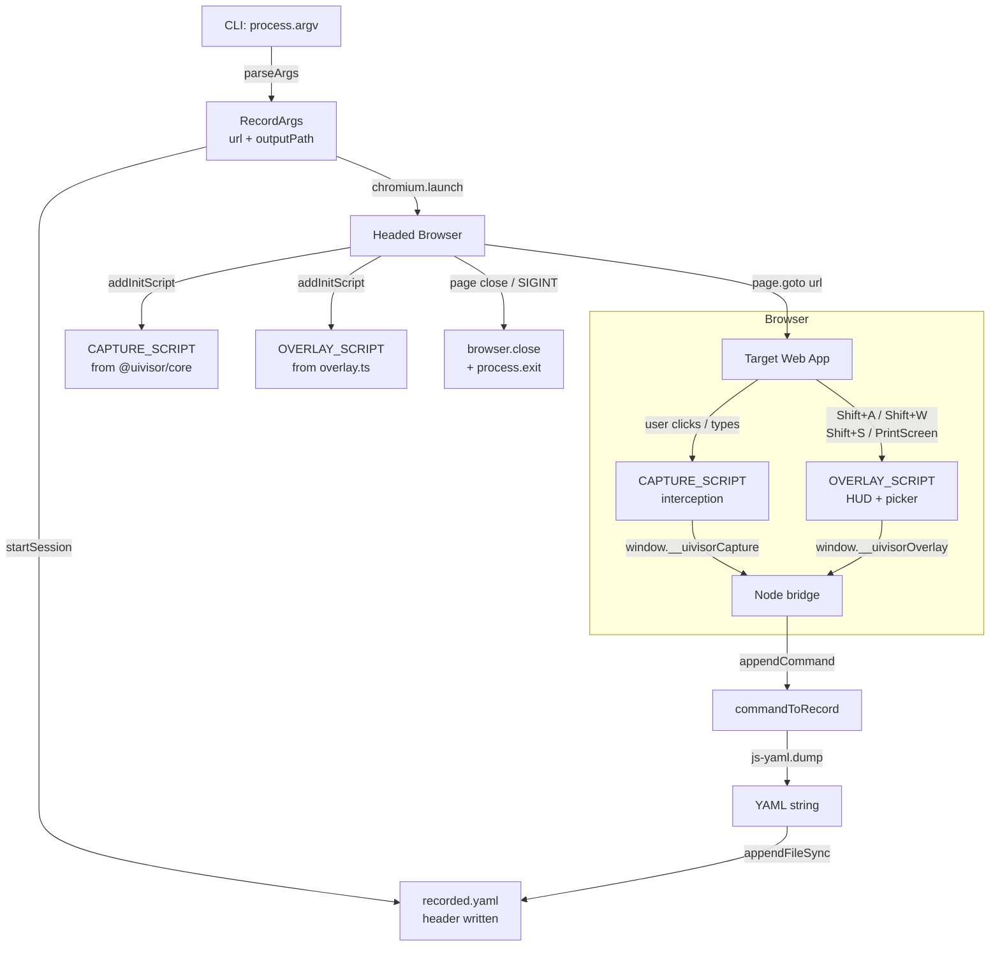

# recorder-app — Data Flow

```mermaid
flowchart TD
    A[CLI: process.argv] -->|parseArgs| B[RecordArgs\nurl + outputPath]
    B -->|startSession| C[recorded.yaml\nheader written]

    B -->|chromium.launch| D[Headed Browser]
    D -->|addInitScript| E[CAPTURE_SCRIPT\nfrom @uivisor/core]
    D -->|addInitScript| F[OVERLAY_SCRIPT\nfrom overlay.ts]
    D -->|page.goto url| G[Target Web App]

    subgraph Browser
        G -->|user clicks / types| H[CAPTURE_SCRIPT\ninterception]
        G -->|Shift+A / Shift+W\nShift+S / PrintScreen| I[OVERLAY_SCRIPT\nHUD + picker]
        H -->|window.__uivisorCapture| J[Node bridge]
        I -->|window.__uivisorOverlay| J
    end

    J -->|appendCommand| K[commandToRecord]
    K -->|js-yaml.dump| L[YAML string]
    L -->|appendFileSync| C

    D -->|page close / SIGINT| M[browser.close\n+ process.exit]
```
