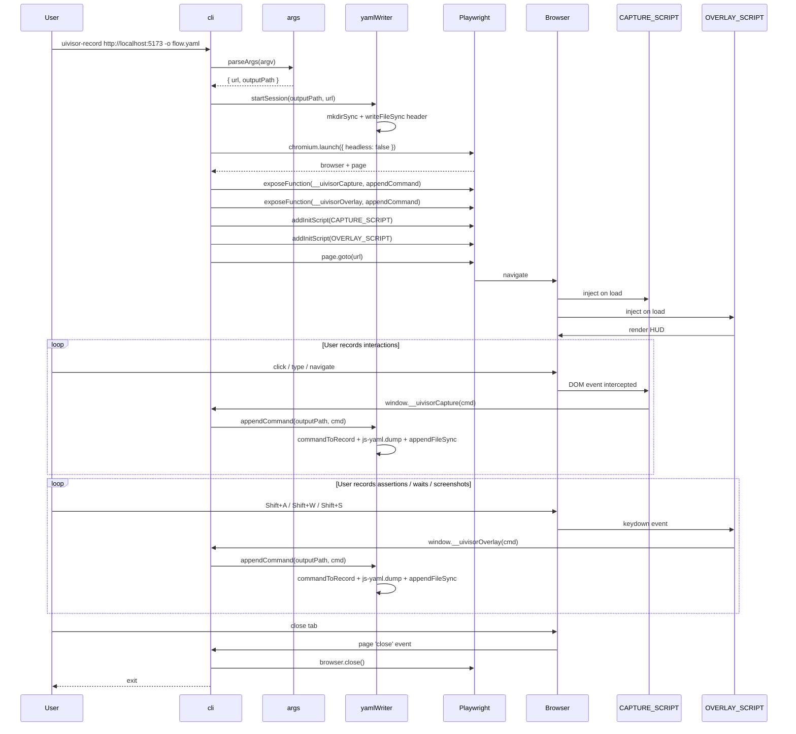

# recorder-app — Sequence Diagram

```mermaid
sequenceDiagram
    participant User
    participant cli
    participant args
    participant yamlWriter
    participant Playwright
    participant Browser
    participant CAPTURE_SCRIPT
    participant OVERLAY_SCRIPT

    User->>cli: uivisor-record http://localhost:5173 -o flow.yaml
    cli->>args: parseArgs(argv)
    args-->>cli: { url, outputPath }

    cli->>yamlWriter: startSession(outputPath, url)
    yamlWriter->>yamlWriter: mkdirSync + writeFileSync header

    cli->>Playwright: chromium.launch({ headless: false })
    Playwright-->>cli: browser + page

    cli->>Playwright: exposeFunction(__uivisorCapture, appendCommand)
    cli->>Playwright: exposeFunction(__uivisorOverlay, appendCommand)
    cli->>Playwright: addInitScript(CAPTURE_SCRIPT)
    cli->>Playwright: addInitScript(OVERLAY_SCRIPT)
    cli->>Playwright: page.goto(url)
    Playwright->>Browser: navigate

    Browser->>CAPTURE_SCRIPT: inject on load
    Browser->>OVERLAY_SCRIPT: inject on load
    OVERLAY_SCRIPT->>Browser: render HUD

    loop User records interactions
        User->>Browser: click / type / navigate
        Browser->>CAPTURE_SCRIPT: DOM event intercepted
        CAPTURE_SCRIPT->>cli: window.__uivisorCapture(cmd)
        cli->>yamlWriter: appendCommand(outputPath, cmd)
        yamlWriter->>yamlWriter: commandToRecord + js-yaml.dump + appendFileSync
    end

    loop User records assertions / waits / screenshots
        User->>Browser: Shift+A / Shift+W / Shift+S
        Browser->>OVERLAY_SCRIPT: keydown event
        OVERLAY_SCRIPT->>cli: window.__uivisorOverlay(cmd)
        cli->>yamlWriter: appendCommand(outputPath, cmd)
        yamlWriter->>yamlWriter: commandToRecord + js-yaml.dump + appendFileSync
    end

    User->>Browser: close tab
    Browser->>cli: page 'close' event
    cli->>Playwright: browser.close()
    cli-->>User: exit
```
