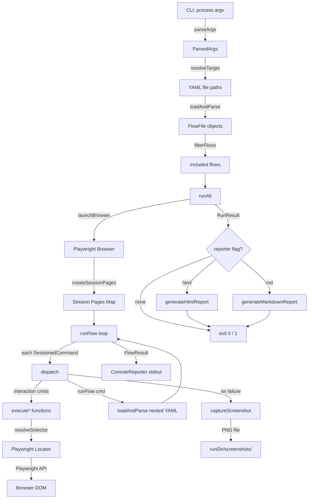

# uivisor-app — Data Flow

```mermaid
flowchart TD
    A[CLI: process.argv] -->|parseArgs| B[ParsedArgs]
    B -->|resolveTarget| C[YAML file paths]
    C -->|loadAndParse| D[FlowFile objects]
    D -->|filterFlows| E[Included flows]

    E --> F[runAll]

    F -->|launchBrowser| G[Playwright Browser]
    G -->|createSessionPages| H[Session Pages Map]

    H --> I[runFlow loop]
    I -->|each SessionedCommand| J[dispatch]

    J -->|interaction cmds| K[execute* functions]
    K -->|resolveSelector| L[Playwright Locator]
    L -->|Playwright API| M[Browser DOM]

    J -->|runFlow cmd| N[loadAndParse nested YAML]
    N --> I

    J -->|on failure| O[captureScreenshot]
    O -->|PNG file| P[runDir/screenshots/]

    I -->|FlowResult| Q[ConsoleReporter stdout]
    F -->|RunResult| R{reporter flag?}

    R -->|html| S[generateHtmlReport]
    R -->|md| T[generateMarkdownReport]
    R -->|none| U[exit 0 / 1]
    S --> U
    T --> U
```
