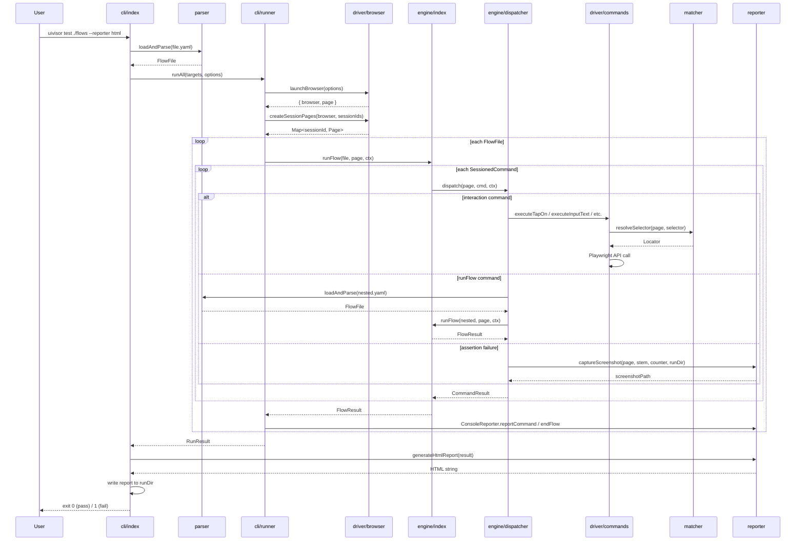

# uivisor-app — Sequence Diagram

```mermaid
sequenceDiagram
    participant User
    participant cli/index
    participant parser
    participant cli/runner
    participant driver/browser
    participant engine/index
    participant engine/dispatcher
    participant driver/commands
    participant matcher
    participant reporter

    User->>cli/index: uivisor test ./flows --reporter html
    cli/index->>parser: loadAndParse(file.yaml)
    parser-->>cli/index: FlowFile

    cli/index->>cli/runner: runAll(targets, options)
    cli/runner->>driver/browser: launchBrowser(options)
    driver/browser-->>cli/runner: { browser, page }
    cli/runner->>driver/browser: createSessionPages(browser, sessionIds)
    driver/browser-->>cli/runner: Map<sessionId, Page>

    loop each FlowFile
        cli/runner->>engine/index: runFlow(file, page, ctx)
        loop each SessionedCommand
            engine/index->>engine/dispatcher: dispatch(page, cmd, ctx)

            alt interaction command
                engine/dispatcher->>driver/commands: executeTapOn / executeInputText / etc.
                driver/commands->>matcher: resolveSelector(page, selector)
                matcher-->>driver/commands: Locator
                driver/commands->>driver/commands: Playwright API call
            else runFlow command
                engine/dispatcher->>parser: loadAndParse(nested.yaml)
                parser-->>engine/dispatcher: FlowFile
                engine/dispatcher->>engine/index: runFlow(nested, page, ctx)
                engine/index-->>engine/dispatcher: FlowResult
            else assertion failure
                engine/dispatcher->>reporter: captureScreenshot(page, stem, counter, runDir)
                reporter-->>engine/dispatcher: screenshotPath
            end

            engine/dispatcher-->>engine/index: CommandResult
        end
        engine/index-->>cli/runner: FlowResult
        cli/runner->>reporter: ConsoleReporter.reportCommand / endFlow
    end

    cli/runner-->>cli/index: RunResult
    cli/index->>reporter: generateHtmlReport(result)
    reporter-->>cli/index: HTML string
    cli/index->>cli/index: write report to runDir
    cli/index-->>User: exit 0 (pass) / 1 (fail)
```
